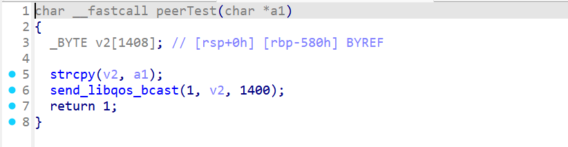
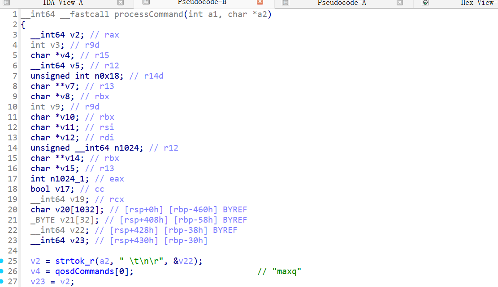
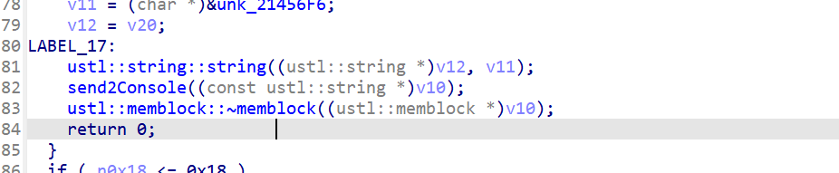

# citrix  nsppe1 console

## Overview

vendor: Citrix

product: Citrix NetScaler ADC 

version: NS14.1.8.50 

type: Stack Overflow

## Vulnerability Description

A stack-based buffer overflow vulnerability has been discovered in the `peerTest()` function at address `0x1c82690` of Citrix NetScaler ADC version NS14.1.8.50. The vulnerability is triggered when processing specially crafted commands sent to the QOSD management console server. The vulnerable function uses the unsafe `strcpy()` function to copy user-supplied input into a fixed-size 1408-byte stack buffer without performing any bounds checking. The binary lacks stack canary protection (`__stack_chk_fail`), making exploitation straightforward as there is no canary value to bypass. Successful exploitation could allow a remote attacker to execute arbitrary code with root privileges, leading to complete system compromise.

**Note:** The QOSD console service is **not enabled by default** and requires manual configuration activation. Standard NetScaler deployments without this service enabled are not affected.

## Vulnerability details

**Root Cause Analysis:** The vulnerability is located within the `peerTest()` function (address `0x1c82690`) of the `nsppe` binary. This function is responsible for handling the `peer_test` command issued via the QOSD management console.

The flaw exists due to the insecure usage of the `strcpy()` C library function. Specifically, the function retrieves the command arguments (the user-controlled string) and copies them into a local stack buffer. Static analysis confirms that the destination buffer has a fixed size of **1408 bytes**.

The `strcpy()` function does not verify the length of the source string against the size of the destination buffer. Consequently, providing a command argument exceeding 1408 bytes overwrites adjacent stack memory, including the saved Frame Pointer (RBP) and the Return Address (RIP).



`processCommand()` Invoking Handler





 **Service Availability:** The QOSD console service is NOT enabled by default on standard NetScaler deployments. The service must be manually activated through configuration before the vulnerability can be exploited. Default installations are not at risk without explicit administrative action to enable this service.

 **Impact:** Successful exploitation allows remote code execution with the privileges of the NetScaler process (typically root), leading to complete system compromise.

#### Call Chain

```c
Network Socket
    ↓ recv(1024 bytes)
pollSocket() @ 0x1c83d60
    ↓ processConsoleStream() @ 0x1c83b60
processConsoleStream()
    ↓ Split on newline (\n)
processCommand() @ 0x1c839d0
    ↓ strtok_r() extracts command name
    ↓ Calls handler with remaining string
peerTest() @ 0x1c82690  ← VULNERABLE FUNCTION
    ↓ strcpy() - UNBOUNDED COPY
    💥 STACK OVERFLOW!
```

## poc

The vulnerability can be triggered by sending a specially crafted command to the QOSD console server:

```
# Connect to console server (if enabled)
nc <target_ip> <console_port>

# Send exploit payload
echo "peer_test $(python -c 'print("A"*1500)')"
```

